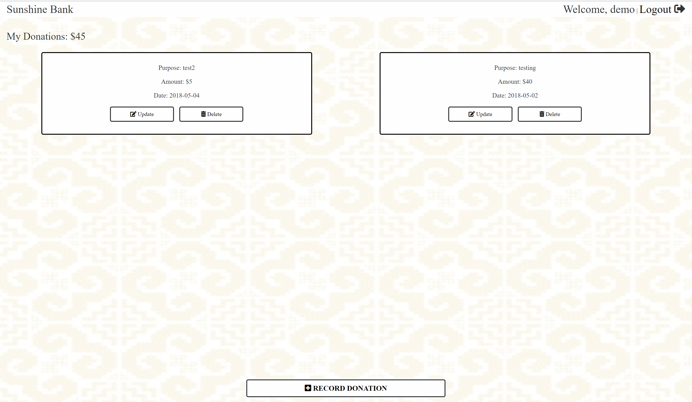

# Sunshine Bank
For Hmong-Americans (https://en.wikipedia.org/wiki/Hmong_Americans), an essential element of our culture is giving money donations to family/friends/community in times of celebration and death. While the ACT of giving the donation is nothing more than making a simple donation, the GIFT itself has a special name in our culture, which is "nyiaj tshav ntuj" or literally translated as "sunshine money" in English. Traditionally, when money is donated during an event, it is recorded by the person/family receiving it, but they don't issue receipts to the donor. For that reason, I decided to create a simple web app named Sunshine Bank that will help Hmong people record and maintain their sunshine money donations.  

## How it works
###Start off by creating an account, if one does not yet exist for you. Or Log in using the demo account.

###Once signed in, you will see all your current donations and the total amount of money you've donated so far.

###Record any donations you have made by clicking on the record donation button and filling out the form with the appropriate information.

###If you need to edit an existing donation, just click the edit button on the donation you wish to edit and update the relevant fields.
 

## Demo
- [Sunshine Bank Demo](https://sunshine-fund.herokuapp.com/index.html)

## Built With The Following 
- Node.js
- Express
- Mongo/Mongoose 
- Mocha/Chai for testing
- Passport for authentication
- TravisCI for continuous integration
- HTML 
- CSS
- JavaScript
- jQuery
- Bootstrap

## Cross Browser Compatibility/Responsiveness
- Google Chrome
- Mozilla Firefox
- Microsoft Edge
- Safari
- Responsive on tablet and mobile devices

## Web App Created By
Quentin Xiong